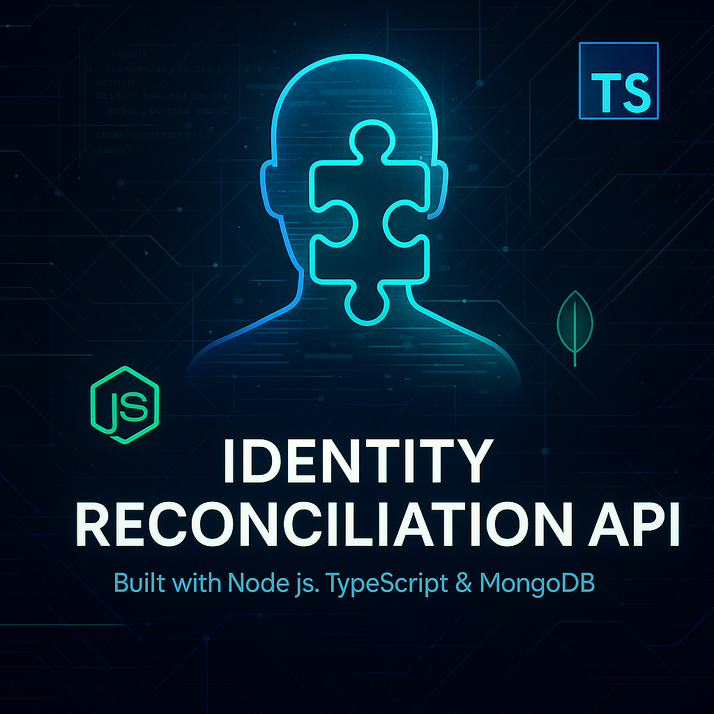

# Identity Reconciliation API


This project implements the **Identity Reconciliation API challenge**.

It is designed to **identify and consolidate user identities** based on `email` and `phoneNumber`, handling multiple records and linking related contacts.

---

## 🚀 Features

* Identify contacts using email or phone number
* Link secondary contacts to primary contact
* Avoid duplicate data and enforce link precedence
* MongoDB + Mongoose backend
* Express.js REST API

---

## 🏗️ Project Structure

```
/src
  /config
    db.ts                  → MongoDB connector
  /controllers
    identityController.ts  → contains the identifyContact logic
  /middleware
    errorHandler.ts        → Handling errors
  /models
    contactModel.ts        → Mongoose schema and model
  /routes
    identityRoutes.ts      → Redirecting /identify
  index.ts                 → Express app setup
```

---

## ⚙️ Setup Instructions

### 1️⃣ Prerequisites

* Node.js (v16+)
* MongoDB (local or Atlas cluster)

---

### 2️⃣ Install Dependencies

```bash
npm install
```

---

### 3️⃣ Configure MongoDB

In your `.env` file, set:

```
MONGODB_URI = <your-mongo-uri>
PORT = 3000
```

Make sure MongoDB is running.

---

### 4️⃣ Start the Server

```bash
npm run dev
npm start
```

The server will run on:

```
http://localhost:3000
```

Or you can test the **deployed API** at:

```
https://identity-reconcillation-ww91.onrender.com
```

---

## 🛠️ MongoDB Notes

Ensure the `contacts` collection **does NOT** have any invalid or legacy indexes like `id_1`.

To check indexes:

```bash
mongo
use bitespeed
db.contacts.getIndexes()
```

To drop a problematic index:

```bash
db.contacts.dropIndex("id_1")
```

---

## 📩 API Endpoint

### **POST /identify**

Identify or create a contact.

**Request body:**

```json
{
  "email": "john@example.com",
  "phoneNumber": "1234567890"
}
```

✅ You can provide either **email**, **phoneNumber**, or **both**.

---

### **Response Structure**

```json
{
  "contact": {
    "primaryContactId": "ObjectId",
    "emails": ["john@example.com", "other@example.com"],
    "phoneNumbers": ["1234567890", "9876543210"],
    "secondaryContactIds": ["ObjectId1", "ObjectId2"]
  }
}
```

* **primaryContactId** → main identity
* **emails** → all associated emails (no duplicates)
* **phoneNumbers** → all associated numbers (no duplicates)
* **secondaryContactIds** → IDs of all linked secondary contacts

---

## 🧠 Logic Summary

1. **Check if email or phoneNumber exists** in any contact.
2. If no match → create a **new primary contact**.
3. If matches exist:

   * Link new info as **secondary** if needed.
   * Ensure **only one primary contact** (oldest).
   * Consolidate all related records.

---

## 🛡️ Error Handling

* 400 → If both `email` and `phoneNumber` are missing.
* 500 → For internal server errors.

---

## 🏗️ Tech Stack

* **Backend:** Node.js, Express.js
* **Database:** MongoDB with Mongoose
* **Types:** TypeScript

---

## 🧪 Testing the API with Postman

1️⃣ Open Postman and create a **new request**.

2️⃣ Set method to **POST** and URL to:

```
https://identity-reconcillation-ww91.onrender.com/api/identify
```

3️⃣ Go to the **Body** tab → Select **raw** → Choose **JSON** format.

4️⃣ Enter a request body like:

```json
{
  "email": "test@example.com",
  "phoneNumber": "19192"
}
```

5️⃣ Click **Send**.

✅ You should see a JSON response with the contact details.

You can test various combinations (email only, phone only, both) to validate reconciliation logic.

---

## 🤝 Contributing

Pull requests are welcome!
Please open an issue first to discuss what you want to change.
